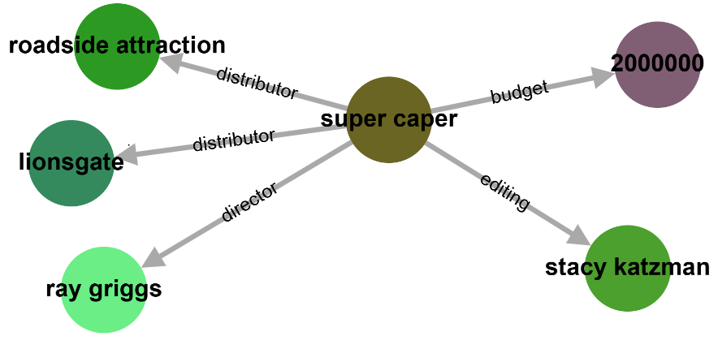

# Leveraging Large Language Models for KG Construction

This repository is part of the research project on **Leveraging Large Language Models for KG Construction** using Large Language Models (LLMs). The benchmark aims to evaluate LLMs for extracting knowledge graph triples from natural language while adhering to a given ontology. The focus is on key evaluation metrics such as precision, recall, F1-score, ontology conformance, and hallucination rates.

## 🧪 Example

**🔎 Test Sentence Example:**

```json
{
  "id": "ont_film_test_1",
  "sent":"Super Capers is a 98 minute English movie that was distributed by Roadside Attractions and Lionsgate. It was directed by Ray Griggs and edited by Stacy Katzman.The budget was $2,000,000."
}
```

**🎼 Ontology Used:** [Film Ontology](data/dbpedia/ontology/19_film_ontology.json)

**📈 Output Graph:**


---
## 🧠 `src/` – Main Source Directory
The `src` directory contains all the code for running LLMs, generating RDF triples, and evaluating outputs. It is organized into submodules for evaluation and model generation.
---
### 📂 [`evaluation`](https://github.com/Balramt/Text_to_Knowledge_Graph_Generation/tree/main/src/evaluation)
Scripts to evaluate the triples extracted from LLM responses.
* 📘 **[Baseline Evaluation](https://github.com/Balramt/Text_to_Knowledge_Graph_Generation/blob/main/src/evaluation/Baseline_evaluation.ipynb)**
  Evaluates precision, recall, F1, and hallucinations (ontology, subject, object, relation) using raw LLM outputs.
* 🛠️ **[Improvised Evaluation](https://github.com/Balramt/Text_to_Knowledge_Graph_Generation/blob/main/src/evaluation/Evaluation_improvised.ipynb)**
  More robust evaluation that cleans special characters and symbols for accurate matching.
---
### 🤖 [`llm_models`](https://github.com/Balramt/Text_to_Knowledge_Graph_Generation/tree/main/src/llm_models)
LLM-based triple generation modules.
* 🔹 **[LLaMA](https://github.com/Balramt/Text_to_Knowledge_Graph_Generation/blob/main/src/llm_models/Llama3_with_batch_without_quant.ipynb)**
  Uses LLaMA to generate text and extract triples from structured prompts.
* 🔹 **[Mistral](https://github.com/Balramt/Text_to_Knowledge_Graph_Generation/blob/main/src/llm_models/Mistral_Batch.ipynb)**
  Parallel implementation using Mistral model to generate and parse triples from prompts.
---

## 📦 Data Structure Overview

### 🗂️ `wikidata_tekgen`
* [Wikidata-TekGen](https://github.com/Balramt/Text_to_Knowledge_Graph_Generation/tree/main/data/wikidata)
* **Ontologies (10)**: [ontologies](https://github.com/Balramt/Text_to_Knowledge_Graph_Generation/tree/main/data/wikidata/ontology) – Ontology files used for triple validation.
* **Ground Truth**: [ground\_truth](https://github.com/Balramt/Text_to_Knowledge_Graph_Generation/tree/main/data/wikidata/ground_truth) – Gold standard triples for evaluation.
* **Prompts**: [prompts](https://github.com/Balramt/Text_to_Knowledge_Graph_Generation/tree/main/data/wikidata/prompts) – Natural language prompts generated for test samples.
  
#### 📊 Baselines – Evaluation Results and LLM Responses
##### 🔹 [Alpaca-LoRA-13B](https://github.com/Balramt/Text_to_Knowledge_Graph_Generation/tree/main/data/wikidata/baselines/Alpaca-LoRA-13B)
* [llm\_responses](https://github.com/Balramt/Text_to_Knowledge_Graph_Generation/tree/main/data/wikidata/baselines/Alpaca-LoRA-13B/llm_response) – Raw responses + extracted triples
* [eval\_metrics](https://github.com/Balramt/Text_to_Knowledge_Graph_Generation/tree/main/data/wikidata/baselines/Alpaca-LoRA-13B/evaluation_statistics/baseline_statistics) – Ontology-level + aggregated results
##### 🔹 [Vicuna-13B](https://github.com/Balramt/Text_to_Knowledge_Graph_Generation/tree/main/data/wikidata/baselines/Vicuna-13B)
* [llm\_responses](https://github.com/Balramt/Text_to_Knowledge_Graph_Generation/tree/main/data/wikidata/baselines/Vicuna-13B/llm_response) – Raw responses + extracted triples
* [eval\_metrics](https://github.com/Balramt/Text_to_Knowledge_Graph_Generation/tree/main/data/wikidata/baselines/Vicuna-13B/evaluation_statistics/baseline_statistics) – Ontology-level + aggregated results
##### 🔹 [Llama-8B](https://github.com/Balramt/Text_to_Knowledge_Graph_Generation/tree/main/data/wikidata/baselines/Llama-8B)
* [llm\_responses](https://github.com/Balramt/Text_to_Knowledge_Graph_Generation/tree/main/data/wikidata/baselines/Llama-8B/llm_response) – Raw responses + extracted triples
* [eval\_metrics](https://github.com/Balramt/Text_to_Knowledge_Graph_Generation/tree/main/data/wikidata/baselines/Llama-8B/evaluation_statistics) – Ontology-level + aggregated results
##### 🔹 [Mistral-7B](https://github.com/Balramt/Text_to_Knowledge_Graph_Generation/tree/main/data/wikidata/baselines/Mistral-7B)
* [llm\_responses](https://github.com/Balramt/Text_to_Knowledge_Graph_Generation/tree/main/data/wikidata/baselines/Mistral-7B/llm_response) – Raw responses + extracted triples
* [eval\_metrics](https://github.com/Balramt/Text_to_Knowledge_Graph_Generation/tree/main/data/wikidata/baselines/Mistral-7B/evaluation_statistics) – Ontology-level + aggregated results


### 🗂️ `dbpedia_webnlg`
* [DBpedia-Webnlg](https://github.com/Balramt/Text_to_Knowledge_Graph_Generation/tree/main/data/dbpedia)
* **Ontologies (19)**: [ontologies](https://github.com/Balramt/Text_to_Knowledge_Graph_Generation/tree/main/data/dbpedia/ontology) – DBpedia ontologies for triple evaluation.
* **Ground Truth**: [ground\_truth](https://github.com/Balramt/Text_to_Knowledge_Graph_Generation/tree/main/data/dbpedia/ground_truth) – Gold standard triple data.
* **Prompts**: [prompts](https://github.com/Balramt/Text_to_Knowledge_Graph_Generation/tree/main/data/dbpedia/prompts) – Prompt files for LLM-based triple generation.

#### 📊 Baselines – Evaluation Results and LLM Responses
##### 🔹 [Alpaca-LoRA-13B](https://github.com/Balramt/Text_to_Knowledge_Graph_Generation/tree/main/data/dbpedia/baselines/Alpaca-LoRA-13B)
* [llm\_responses](https://github.com/Balramt/Text_to_Knowledge_Graph_Generation/tree/main/data/dbpedia/baselines/Alpaca-LoRA-13B/llm_response) – Raw responses + extracted triples
* [eval\_metrics](https://github.com/Balramt/Text_to_Knowledge_Graph_Generation/tree/main/data/dbpedia/baselines/Alpaca-LoRA-13B/evaluation_statistics/baseline_statistics) – Ontology-level + aggregated results
##### 🔹 [Vicuna-13B](https://github.com/Balramt/Text_to_Knowledge_Graph_Generation/tree/main/data/dbpedia/baselines/Vicuna-13B)
* [llm\_responses](https://github.com/Balramt/Text_to_Knowledge_Graph_Generation/tree/main/data/dbpedia/baselines/Vicuna-13B/llm_response) – Raw responses + extracted triples
* [eval\_metrics](https://github.com/Balramt/Text_to_Knowledge_Graph_Generation/tree/main/data/dbpedia/baselines/Vicuna-13B/evaluation_statistics/baseline_statistics) – Ontology-level + aggregated results
##### 🔹 [Llama-8B](https://github.com/Balramt/Text_to_Knowledge_Graph_Generation/tree/main/data/dbpedia/baselines/Llama-8B)
* [llm\_responses](https://github.com/Balramt/Text_to_Knowledge_Graph_Generation/tree/main/data/dbpedia/baselines/Llama-8B/llm_response) – Raw responses + extracted triples
* [eval\_metrics](https://github.com/Balramt/Text_to_Knowledge_Graph_Generation/tree/main/data/dbpedia/baselines/Llama-8B/evaluation_statistics) – Ontology-level + aggregated results
##### 🔹 [Mistral-7B](https://github.com/Balramt/Text_to_Knowledge_Graph_Generation/tree/main/data/dbpedia/baselines/Mistral-7B)
* [llm\_responses](https://github.com/Balramt/Text_to_Knowledge_Graph_Generation/tree/main/data/dbpedia/baselines/Mistral-7B/llm_response) – Raw responses + extracted triples
* [eval\_metrics](https://github.com/Balramt/Text_to_Knowledge_Graph_Generation/tree/main/data/dbpedia/baselines/Mistral-7B/evaluation_statistics) – Ontology-level + aggregated results

## 📊 Wilcoxon Signed-Rank Test: LLM Comparison on Wikidata and DBpedia

We conducted pairwise statistical significance tests using the **Wilcoxon Signed-Rank Test** to compare the performance of large language models (LLMs) — **LLama 3-8B**, **Mistral**, **Alpaca-LoRA-13B**, and **Vicuna** — on two datasets: **Wikidata** and **DBpedia**. 

Two types of evaluations were used:
- **Improvised Evaluation**: Sample-wise F1 scores
- **Baseline Evaluation**: Per-domain average F1 scores

---

### 📁 Dataset: [Wikidata](#)
We can clearly see that **LLama 3-8B** and **Mistral** consistently outperform the baseline models **Alpaca-LoRA-13B** and **Vicuna** across both evaluation methods.

#### 🔍 Wilcoxon Signed-Rank Test on Improvised Evaluation (Wikidata)


---
## 📁 Folder Tree (Example)
```
.
├── UI/
│   └── KG_Visualization.PNG
│   ├── Tesct2KG_UI.ipynb
|   ├── UI_Readme.md
├── src/
│   ├── evaluation/
│   │   └── Baseline_evaluation.ipynb
│   │   └── Evaluation_improvised.ipynb
│   └── llm_models/
│       └── Llama3_with_batch_without_quant.ipynb
│       └── Mistral_Batch.ipynb
│
├── evaluation_table/
|   ├──dbpedia_ebaluation_result/
|   |  └── Evaluation_Table_Improved.md
|   |  └── Evaluation_Table_baseline.md
|   |  └── wilcoxon_rank_test_dbpedia.ipynb
|   ├──dbpedia_ebaluation_result/
|      └── Evaluation_Table_Improved.md
|      └── Evaluation_Table_baseline.md
|      └── wilcoxon_rank_test_wikidata.ipynb  
|
└── data/
    ├── dbpedia/
    │   ├── ontology/
    │   ├── ground_truth/
    │   ├── prompts/
    │   └── baselines/
    │       ├── Alpaca-LoRA-13B/
    │       │   ├── llm_response/
    │       │   └── evaluation_statistics/
    │       │       └── baseline_statistics/
    │       ├── Vicuna-13B/
    │       │   ├── llm_response/
    │       │   └── evaluation_statistics/
    │       │       └── baseline_statistics/
    │       ├── Llama-8B/
    │       │   ├── llm_response/
    │       │   └── evaluation_statistics/
    |       |   └── evaluation_statistics/
    │       └── Mistral-7B/
    │           ├── llm_response/
    │           └── evaluation_statistics/
    |           └── evaluation_statistics/
    │
    └── wikidata/
        ├── ontology/
        ├── ground_truth/
        ├── prompts/
        └── baselines/
            ├── Alpaca-LoRA-13B/
            │   ├── llm_response/
            │   └── evaluation_statistics/
            │       └── baseline_statistics/
            ├── Vicuna-13B/
            │   ├── llm_response/
            │   └── evaluation_statistics/
            │       └── baseline_statistics/
            ├── Llama-8B/
            │   ├── llm_response/
            │   └── evaluation_statistics/
            └── Mistral-7B/
                ├── llm_response/
                └── evaluation_statistics/

```
